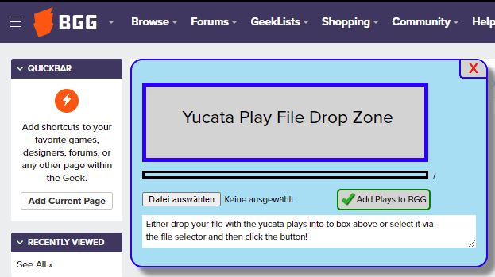

# *Yucata.de* play auto logger for *BGG*

This tool allows you to create play logs at *[BGG](https://www.boardgamegeek.com/)* from the plays you've done at and downloaded from *[Yucata.de](https://www.yucata.de/)*.

## How it works

Follow these setps:
1. **Download your *Yucata.de* plays into a local file**  
Navigate to your *Yucata.de* "Game History" (`https://www.yucata.de/en/Ranking/<YourYucataUser>`). Select "All games" in the "Filter by game" dropdown menu. After the page has loaded, click on the download button in the top right of the screen. This will save all selected plays in a file called `yucataplays.json`.
2. **Create a browser bookmark for running *YucataPlayLoggerForBGG***  
Create some bookmark in your browser. Then edit it and change its target URL to:  
"`javascript:{{document.SPLUcode="";document.SPLUxml="";var SPLUscript=document.createElement('script');SPLUscript.type="text/javascript";SPLUscript.src='https://yucata-de.github.io/YucataPlayLoggerForBGG/Source Code/SPLU-Current.js';document.body.appendChild(SPLUscript);};void(0); }`"  
(you can find this string also in `.Bookmarklets/SPLU-Current.txt`). Change the bookmark name and save it.
3. **Log on to your [*BGG* account](https://www.boardgamegeek.com/)**  
Before you use this tool with your real *BGG* account, I recommd that you first try it with some test-*BGG* account. Those can be easily created. Please remember to delete your test account afterwards which should also delete the plays of your test account. This way your plays at *BGG* are not doubled and the *BGG* data is kept realistic.
4. **Click your edited browser bookmark to start the *YucataPlayLoggerForBGG* dialog**
5. **Upload your local file with your *yucata.de* plays**

## Frequently Asked Questions

- **If I run *YucataPlayLoggerForBGG* twice with the same file, will my *BGG* play logs be doubled ?**  
No. *YucataPlayLoggerForBGG* reads all your *BGG* plays first, checks them and only creates the play logs that don't exist yet. *YucataPlayLoggerForBGG* does this by looking into the comment of a *BGG* play log and checking whether it contains the link to the corresponding play at *Yucata.de*, e.g. `https://www.yucata.de/en/Game/OnTheUnderground/11874329`. This URL contains the id of the corresponding play at *Yucata.de* and therefore can be used as a key.
- **When I try to download all my *Yucata.de* plays into a local file, I click the download button but nothing happens**  
The number of plays you try to download might be too high for the system to process them in one single step. Try to split the time period of all your plays into several smaller periods, set the filter for each period accordingly to create *several* `yucataplays.json` files. Then Upload each file to [BGG][], one after the other, following the steps desribes above.

## Addition Info

This dialog is based on *[SPLU](https://github.com/dazeysan/SPLU)*. Thanks to the SPLU developers for the idea and code base! *[SPLU](https://github.com/dazeysan/SPLU)* allows comfortable play editing. See [SPLU BGG Guild](https://www.boardgamegeek.com/guild/3403).

[BGG]: https://boardgamegeek.com/
